# TP Kubernetes - Étape 1 : Manipulations Kubernetes

## Informations
- **Date**: 1er Janvier 2026
- **Environnement**: Minikube avec profil knative
- **Driver**: Docker

---

## Gestion de Minikube

### 1. Démarrer Minikube

**Commande:**
```bash
minikube start --profile knative --driver=docker
```
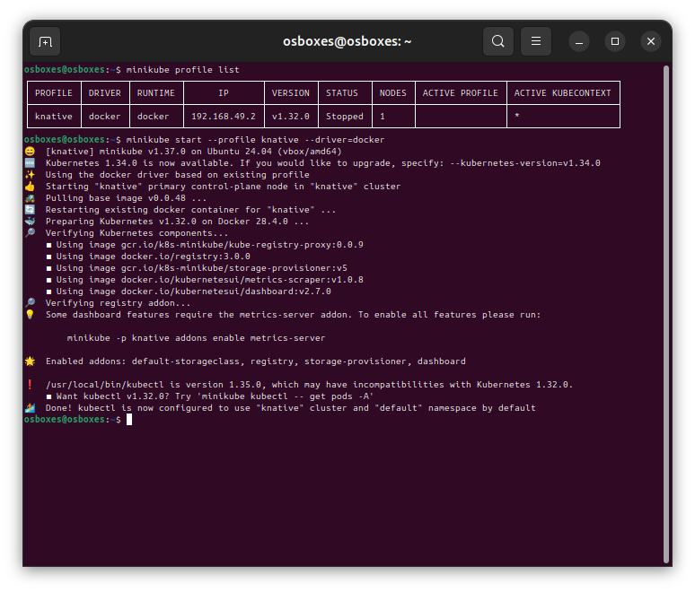
**Résultat:** Minikube démarre avec succès et crée un cluster Kubernetes avec le profil "knative".

---

### 2. Vérifier que Minikube pointe vers le moteur Docker

**Commande:**
```bash
minikube profile list
docker ps | grep minikube
```

**Résultat:**
- Minikube utilise bien le driver Docker
- Un conteneur Docker nommé "knative" est en cours d'exécution
- Le profil knative est actif avec le runtime Docker

---

### 3. Lister les addons actuellement installés

**Commande:**
```bash
minikube addons list --profile knative
```
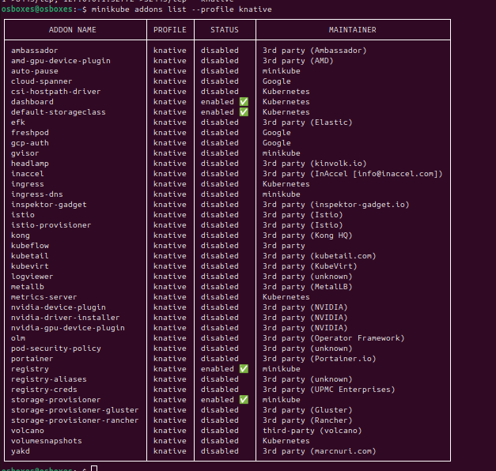
**Résultat - Addons activés:**
-  **default-storageclass** - Kubernetes
-  **storage-provisioner** - minikube  
-  **registry** - minikube
-  **dashboard** - Kubernetes (activé manuellement)

**Addons disponibles mais désactivés:**
- ingress, metrics-server, istio, metallb, etc.

---

### 4. Lister les profils actifs sous Minikube

**Commande:**
```bash
minikube profile list
```
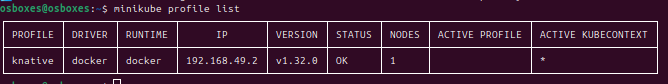
**Résultat:**
```
PROFILE  DRIVER  RUNTIME  IP             VERSION  STATUS  NODES
knative  docker  docker   192.168.49.2   v1.32.0  OK      1
```

**Caractéristiques du profil:**
- **Nom**: knative
- **Driver**: docker
- **Runtime**: docker
- **IP**: 192.168.49.2
- **Version Kubernetes**: v1.32.0
- **Statut**: OK
- **Nombre de nœuds**: 1

---

### 5. Créer un nouveau profil

**Commande:**
```bash
minikube start --profile mon-nouveau-profil --driver=docker
```
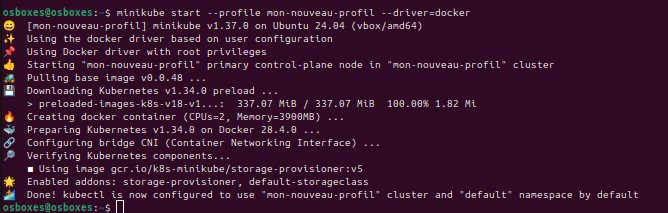
**Qu'est-ce qu'un profil ?**
Un profil Minikube permet de créer et gérer plusieurs clusters Kubernetes indépendants sur la même machine. Chaque profil a:
- Sa propre configuration
- Ses propres ressources (CPU, mémoire)
- Son propre ensemble de pods et services
- Son propre contexte kubectl

**Utilité:**
- Tester différentes versions de Kubernetes
- Isoler des environnements (dev, test, prod)
- Expérimenter sans affecter d'autres projets

---

### 6. Afficher le statut de Minikube

**Commande:**
```bash
minikube status --profile knative
```

**Résultat:**
```
knative
type: Control Plane
host: Running
kubelet: Running
apiserver: Running
kubeconfig: Configured
```

**Explication:**
- **type**: Control Plane - nœud maître du cluster
- **host**: Running - la VM/conteneur est actif
- **kubelet**: Running - agent Kubernetes actif
- **apiserver**: Running - API Kubernetes accessible
- **kubeconfig**: Configured - kubectl configuré

---

### 7. Accéder au Dashboard de Minikube

**Commande:**
```bash
minikube dashboard --profile knative
```
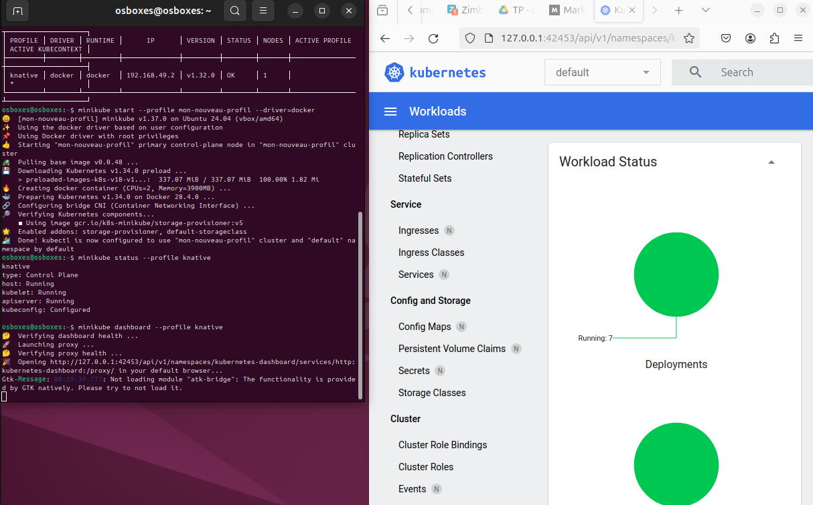

**Qu'est-ce que le Dashboard ?**
Le Dashboard Kubernetes est une interface web qui permet de:
- Visualiser l'état du cluster
- Voir les pods, services, deployments
- Consulter les logs des conteneurs
- Gérer les ressources (créer, modifier, supprimer)
- Monitorer l'utilisation des ressources
- Déboguer les applications

**Ce qu'il présente:**
- Vue d'ensemble du cluster
- Workloads (Deployments, Pods, ReplicaSets)
- Services et Ingress
- Configuration (ConfigMaps, Secrets)
- Storage (PVC, PV)
- Namespaces
- Événements et logs

---

### 8. Lister les nœuds d'un profil

**Commande:**
```bash
kubectl get nodes
```
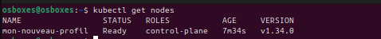

**Résultat:**
```
NAME      STATUS   ROLES           AGE   VERSION
knative   Ready    control-plane   80m   v1.32.0
```

**Informations:**
- 1 nœud nommé "knative"
- Statut: Ready
- Rôle: control-plane (nœud maître)
- Version Kubernetes: v1.32.0

---

### 9. Ajouter et supprimer un nœud

**Commande pour ajouter un nœud:**
```bash
minikube node add --profile knative
```

**Commande pour supprimer un nœud:**
```bash
minikube node delete <node-name> --profile knative
```

**Note:** Dans notre configuration avec 1 seul nœud control-plane, l'ajout de nœuds workers permet de simuler un cluster multi-nœuds.

---

### 10. Consulter les logs de Minikube

**Commande:**
```bash
minikube logs --profile knative
```
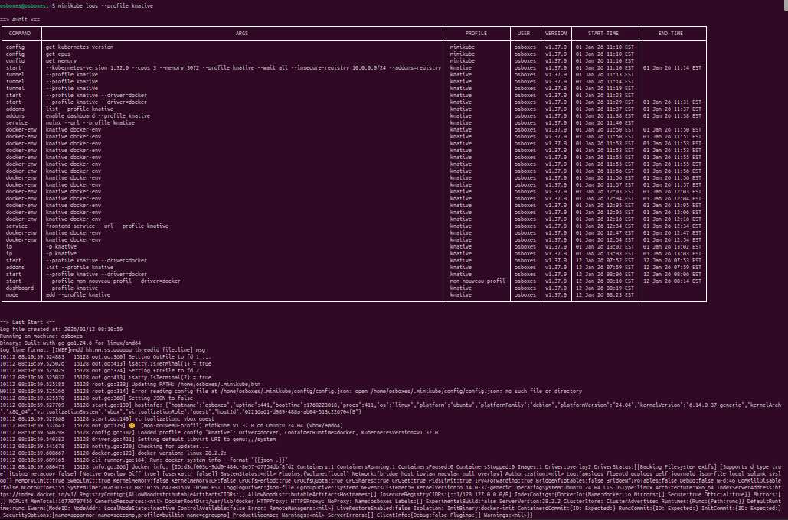

**Alternative pour logs en temps réel:**
```bash
minikube logs -f --profile knative
```

**Utilité:**
- Déboguer les problèmes de démarrage
- Voir les erreurs du cluster
- Analyser les événements système
- Vérifier les composants Kubernetes

---

### 11. Installer un addon intéressant

**Addon choisi: metrics-server**

**Commande:**
```bash
minikube addons enable metrics-server --profile knative
```
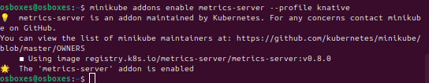

**Pourquoi metrics-server ?**
- Collecte les métriques de ressources (CPU, mémoire)
- Nécessaire pour l'autoscaling (HPA)
- Permet d'utiliser `kubectl top nodes` et `kubectl top pods`
- Essentiel pour le monitoring des performances
- Utilisé par le Dashboard pour afficher les graphiques

**Vérification:**
```bash
kubectl top nodes
kubectl top pods
```

---

## Gestion des Pods et Services

### 12. Lister les images en exécution

**Commande:**
```bash
minikube image ls --profile knative
```
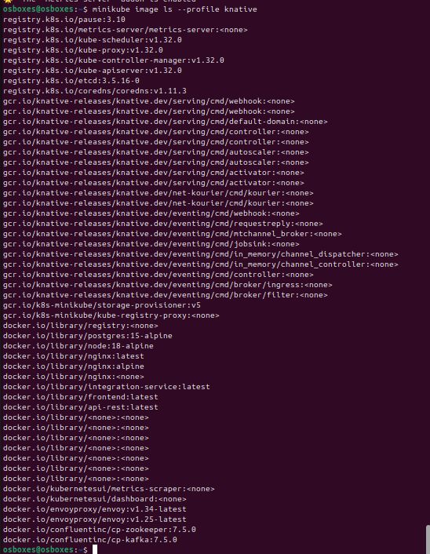

**Résultat:** Liste toutes les images Docker présentes dans le cluster Minikube, incluant:
- Images système Kubernetes (kube-apiserver, etcd, coredns, etc.)
- Images Knative
- Images de nos applications (api-rest, integration-service, frontend)

---

### 13. Lancer une image nginx en mode impératif

**Commande (Deployment):**
```bash
kubectl create deployment nginx --image=nginx
```
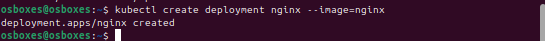
**Résultat:**
```
deployment.apps/nginx created
```

**Vérification:**
```bash
kubectl get deployments
kubectl get pods -l app=nginx
```

---

### 14. Créer un service pour nginx en mode impératif

**Commande:**
```bash
kubectl expose deployment nginx --type=NodePort --port=80
```
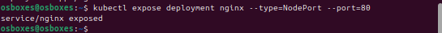
**Résultat:**
```
service/nginx exposed
```

**Explication:**
- **type=NodePort**: Expose le service sur un port du nœud
- **port=80**: Port du service (interne au cluster)
- Le NodePort est assigné automatiquement (30000-32767)

---

### 15. Visualiser les informations du pod et du service

**Commande pour le pod:**
```bash
kubectl get pods -l app=nginx
kubectl describe pod -l app=nginx
```
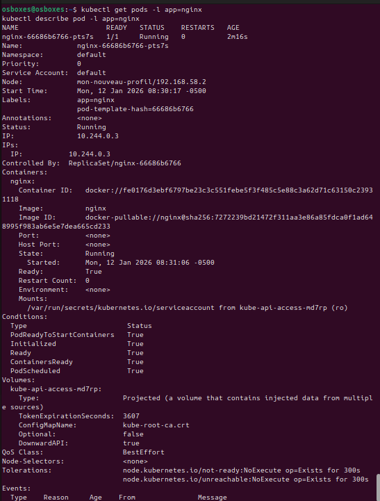
**Commande pour le service:**
```bash
kubectl get svc nginx
kubectl describe svc nginx
```

**Informations affichées:**
- **Pod**: Nom, statut, IP, nœud, image, ressources
- **Service**: Type, ClusterIP, Port, NodePort, Endpoints

---

### 16. Obtenir l'URL du service

**Commande:**
```bash
minikube service nginx --url --profile knative
```
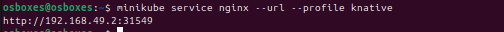

**Résultat:**
```
http://192.168.49.2:31549
```

Cette URL permet d'accéder au service nginx depuis l'extérieur du cluster.

---

### 17. Exécuter le service dans un navigateur

**Commande:**
```bash
minikube service nginx --profile knative
```
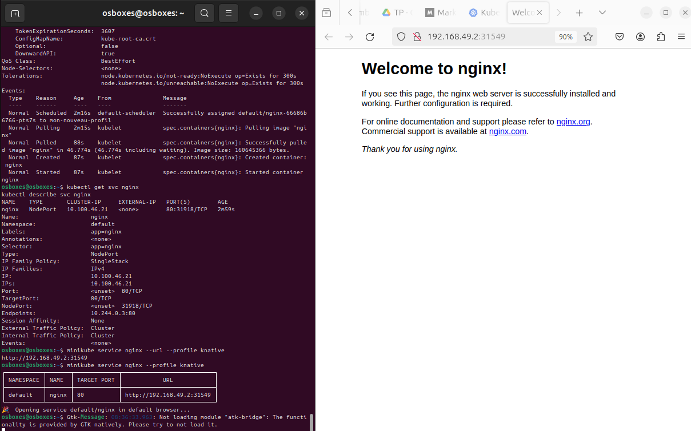

Cette commande ouvre automatiquement le navigateur par défaut avec l'URL du service.

**Alternative avec curl:**
```bash
curl http://192.168.49.2:31549
```

**Résultat attendu:** Page d'accueil par défaut de nginx.

---

### 18. Lancer une commande bash dans le conteneur nginx

**Commande:**
```bash
kubectl exec -it <pod-name> -- /bin/bash
```

**Exemple:**
```bash
kubectl exec -it nginx-66686b6766-pts7s -- /bin/bash
```

**Une fois dans le conteneur:**
```bash
ls -la /usr/share/nginx/html/
cat /etc/nginx/nginx.conf
exit
```
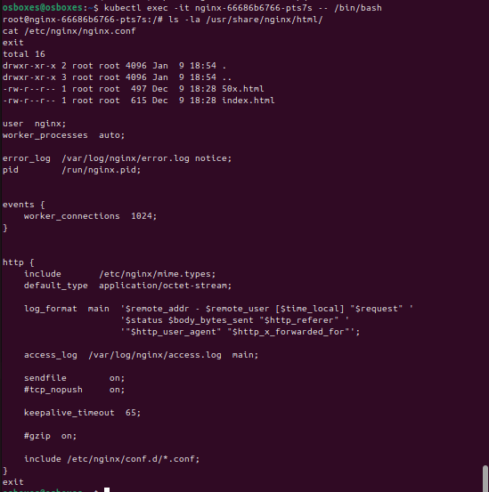
---

### 19. Lister les logs du conteneur nginx

**Commande:**
```bash
kubectl logs <pod-name>
```

**Exemple:**
```bash
kubectl logs nginx-66686b6766-pts7s
```
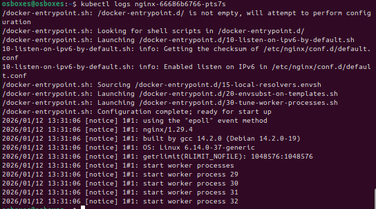

**Pour suivre les logs en temps réel:**
```bash
kubectl logs -f nginx-66686b6766-pts7s
```

**Pour les dernières N lignes:**
```bash
kubectl logs --tail=50 nginx-66686b6766-pts7s
```

---

### 20. Arrêter Minikube

**Commande:**
```bash
minikube stop --profile knative
```

**Résultat:** Le cluster est arrêté mais les données persistent. Au prochain démarrage, tout sera restauré.

**Pour supprimer complètement le cluster:**
```bash
minikube delete --profile knative
```
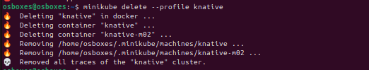

---

## Conclusion de l'Étape 1

Toutes les manipulations Kubernetes de base ont été réalisées avec succès:
-  Configuration et gestion de Minikube
-  Gestion des profils et addons
-  Déploiement impératif de pods et services
-  Accès et debugging des applications
-  Consultation des logs et métriques

Le cluster Minikube est maintenant prêt pour le déploiement de l'architecture EDA complète (Étape 2).
